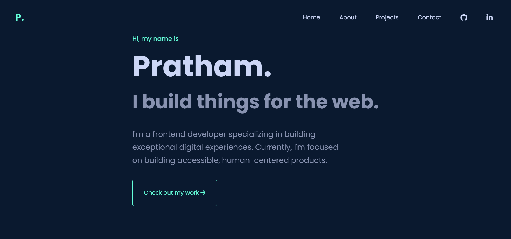

# Personal Portfolio Website

A modern, responsive portfolio website built with HTML, CSS, and JavaScript.



## 🌟 Features

- **Modern Design**
  - Clean and minimalist interface
  - Dark theme with accent colors
  - Smooth scrolling and animations
  - Responsive layout for all devices

- **Navigation**
  - Fixed navigation bar with blur effect
  - Smooth scroll to sections
  - Social media links integration
  - Mobile-friendly menu

- **Sections**
  1. **Hero Section**
     - Personal introduction
     - Call-to-action button
     - Fade-in animation
  
  2. **About Section**
     - Professional summary
     - Circular profile picture with hover effects
     - Skills list with custom bullets
     - Technologies and tools

  3. **Projects Section**
     - Project cards with hover effects
     - Technology stack tags
     - Project descriptions
     - Links to live demos and repositories

  4. **Contact Section**
     - Social media links
     - Professional links (GitHub, LinkedIn)
     - Contact information

## 🎨 Color Scheme

```css
:root {
    --primary: #0a192f;    // Dark blue background
    --secondary: #112240;  // Slightly lighter blue
    --accent: #64ffda;    // Cyan accent color
    --text: #8892b0;      // Light gray text
    --bg: #0a192f;        // Main background color
}
```

## 🚀 Getting Started

1. **Clone the repository**
   ```bash
   git clone https://github.com/Pratham00007/Portfolio.git
   ```

2. **Navigate to project directory**
   ```bash
   cd portfolio
   ```

3. **Open index.html in your browser**
   - Double click index.html or
   - Use Live Server in VS Code

## 📱 Responsive Design

- **Desktop**: Full layout with all features
- **Tablet**: Adjusted spacing and font sizes
- **Mobile**: 
  - Collapsible navigation
  - Stacked layout
  - Optimized images
  - Touch-friendly buttons

## 💻 Technologies Used

- HTML5
- CSS3
- JavaScript
- Font Awesome Icons
- Google Fonts (Poppins)

## ✨ Special Features

1. **Animations**
   - Fade-in effects on scroll
   - Hover transitions
   - Smooth section transitions

2. **Image Effects**
   - Circular profile picture
   - Grayscale to color transition
   - Border animation

3. **Interactive Elements**
   - Hover effects on buttons
   - Social media icon animations
   - Project card transformations

## 📄 File Structure

```
portfolio/
│
├── index.html          # Main HTML file
└── README.md          # Documentation
```

## 🛠️ Customization

1. **Personal Information**
   - Update text in index.html
   - Replace profile picture
   - Modify social media links

2. **Color Scheme**
   - Edit CSS variables in :root
   - Adjust opacity values
   - Change gradient values

3. **Projects**
   - Add new project cards
   - Update screenshots
   - Modify technology tags

## 📝 License

This project is open source and available under the [MIT License](LICENSE).

## 🤝 Contributing

Contributions, issues, and feature requests are welcome! Feel free to check [issues page](https://github.com/Pratham00007/portfolio/issues).

## 📞 Contact

- GitHub: [@Pratham00007](https://github.com/Pratham00007)
- LinkedIn: [Pratham](https://linkedin.com/in/pratham-khetrapal)